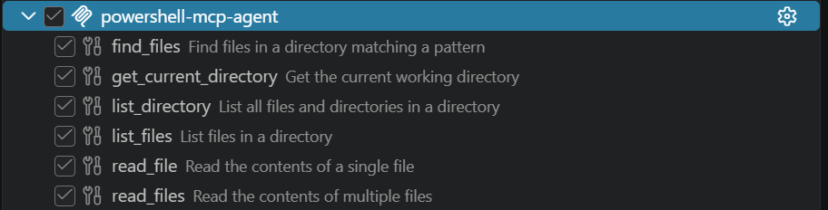
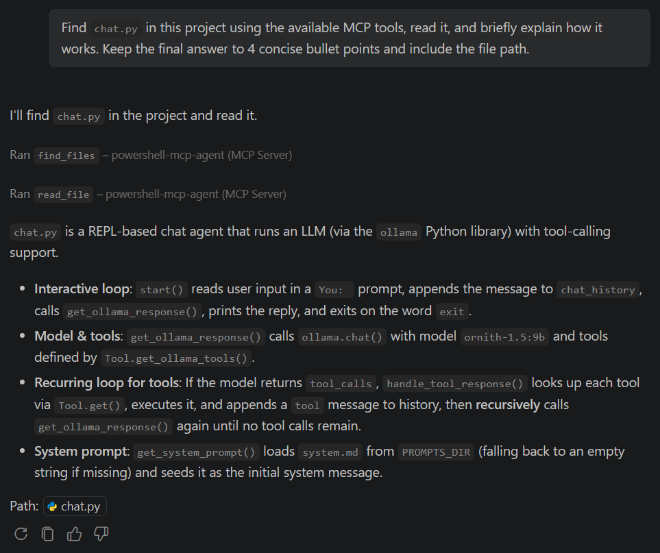

# PowerShell MCP Agent

An experimental MCP server and local Ollama agent that delegate deterministic filesystem work to PowerShell and return structured results to language models.

GitHub Copilot can access the tools through MCP, while a local Ollama agent can use the same shared tool registry directly.

## Idea

The core idea is to keep deterministic work on the local machine and use the language model mainly for decision-making.

Instead of asking the model to reason through filesystem operations, inspect large repository contexts, or repeatedly inspect the same data, it selects the required operation and delegates it to a PowerShell script.

PowerShell performs the task directly on the machine and returns only the relevant structured result back to the model.

The goal is to make agent workflows more:

- **efficient** — deterministic work is executed locally instead of consuming model context;
- **fast** — deterministic filesystem operations are executed directly by local tools instead of being handled through model reasoning;
- **precise** — scripts return actual system state instead of relying on the model to infer it;
- **token-efficient** — the model receives focused results instead of large amounts of unnecessary repository context;
- **lightweight** — smaller local models can focus on choosing actions and interpreting results rather than doing everything themselves.

This approach also makes it possible to build specialized agents with narrow responsibilities, where each agent uses a small set of deterministic local tools and passes only the necessary results further in the workflow.

## How it works

Both GitHub Copilot and the local Ollama agent use the same shared tool layer:

```text id="6cllop"
GitHub Copilot ── MCP ───────┐
                             │
                             ├── Tool Registry ── Python wrappers ── PowerShell scripts
                             │
Local Ollama Agent ──────────┘
```

The Tool Registry is the single source of truth for tool names, descriptions, JSON schemas, and execution functions.

A typical request follows this path:

```text
User request
   ↓
Model selects a tool
   ↓
Tool Registry dispatches the call
   ↓
PowerShell performs the filesystem operation
   ↓
Structured result is returned
   ↓
Model produces the final response
```

### Available tools

| Tool                    | Description                              |
| ----------------------- | ---------------------------------------- |
| `get_current_directory` | Returns the current working directory.   |
| `list_files`            | Lists files inside a directory.          |
| `list_directory`        | Lists files and directories.             |
| `find_files`            | Recursively searches for matching files. |
| `read_file`             | Reads one file.                          |
| `read_files`            | Reads multiple files in one call.        |

Tools return a common structured result:

```json
{
  "status": "success",
  "content": {},
  "error": null,
  "meta": {
    "exit_code": 0,
    "truncated": false
  }
}
```

## GitHub Copilot integration

The MCP server exposes the PowerShell-backed tools directly to GitHub Copilot in VS Code Agent mode.

Example prompt:

```text id="8jz7xa"
Find `chat.py` in this project using the available MCP tools,
read it, and briefly explain how it works.
```

Copilot selects the tools, the MCP server dispatches them through the shared registry, and PowerShell performs the filesystem work.

<p align="center">
  
</p>

<p align="center">
  <em>GitHub Copilot discovering the tools exposed by the PowerShell MCP server.</em>
</p>

<p align="center">
  
</p>

<p align="center">
  <em>Copilot invoking MCP tools to locate and read project files before producing a concise explanation.</em>
</p>

## Usage

Requirements: Windows, Python 3.11+, PowerShell, and `pipx`.

Install the project:

```powershell id="wih470"
git clone https://github.com/fftim-dev/powershell-mcp-agent.git
cd powershell-mcp-agent
pipx install .
```

This installs two CLI commands:

```text
pwsh-mcp     MCP server for GitHub Copilot and other MCP clients
pwsh-agent   Local Ollama agent
```

### GitHub Copilot / MCP

Create `.vscode/mcp.json` in the project where you want to use the tools:

```json
{
  "servers": {
    "powershell-mcp-agent": {
      "type": "stdio",
      "command": "pwsh-mcp"
    }
  }
}
```

Then open GitHub Copilot Chat in Agent mode and enable the MCP tools.

### Local Ollama agent

Make sure Ollama is running and the configured model is available:

```powershell
ollama pull ornith-1.5:9b
pwsh-agent
```

The local agent uses the same Tool Registry and PowerShell tools as the MCP server.

## Roadmap

- more filesystem tools;
- configurable Ollama models;
- scoped write/edit tools;
- workspace boundaries;
- performance and token-efficiency benchmarks;
- specialized and multi-agent workflows;
- REST API with OpenAPI/Swagger.

## License

MIT